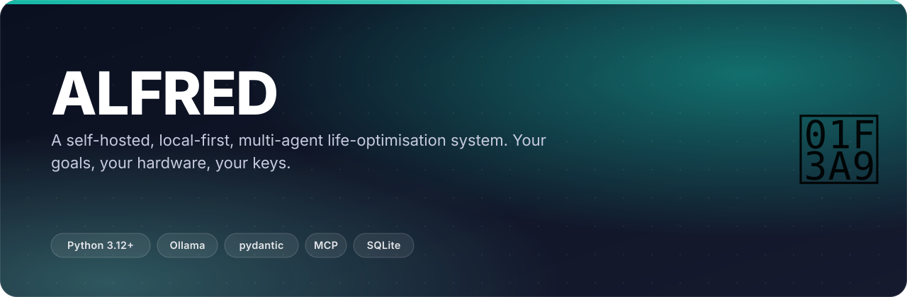
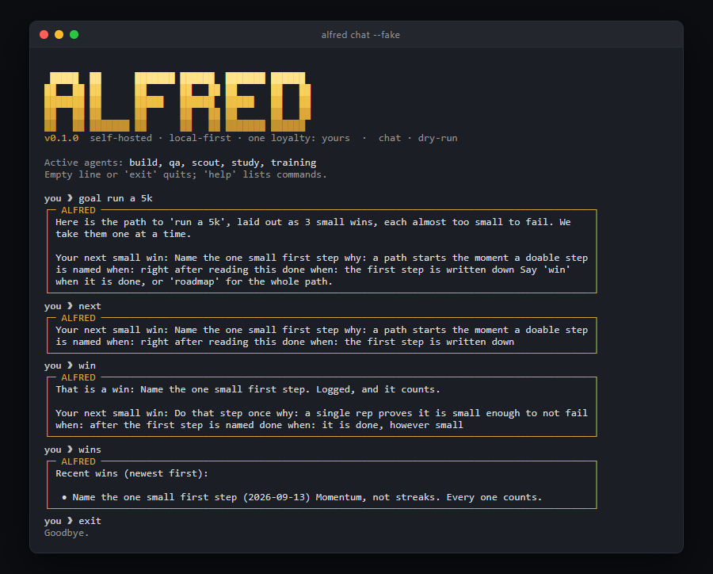
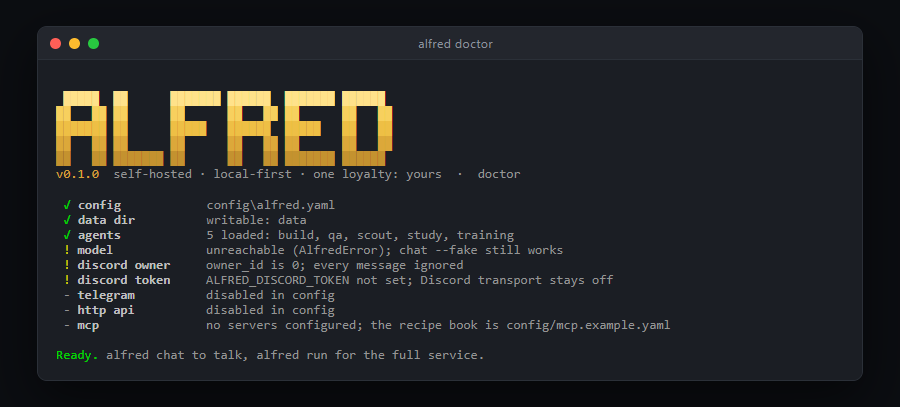
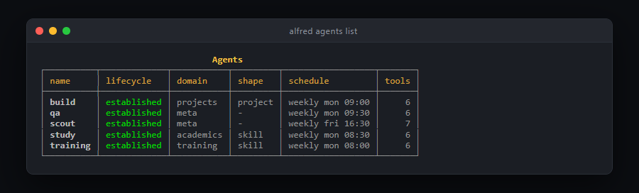
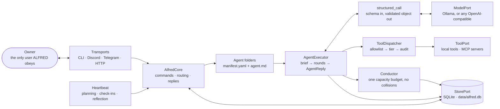

<p align="center"></p>

<p align="center">
  <b>The most important AI in your life should not live in a corporate data centre optimising for engagement.</b><br>
  <sub>Your goals. Your hardware. Your keys. One loyalty: yours.</sub>
</p>

<p align="center">
  <a href="https://github.com/ChinmayGit8765/AlfredOpenSource/actions/workflows/ci.yml"></a>
  <a href="pyproject.toml"></a>
  <a href="LICENSE"></a>
  <a href="tests/"></a>
  <a href="https://github.com/ChinmayGit8765/AlfredOpenSource/stargazers"></a>
</p>

ALFRED runs on hardware you own, holds your data in a local SQLite file, thinks
with a local model, and answers to one loyalty only: your flourishing. It takes
your goals, decomposes them into concurrent weekly plans that do not collide,
delivers them over a messaging channel, watches what actually happens, and
adjusts. It is built to make itself unnecessary: the better it works, the less
you should need it.

## ✨ What it does

- **Turns a goal into a path of small wins.** `goal run a 5k` lays out milestones
  each *almost too small to fail*, each with an observable done-signal and
  anchored to a cue already in your day. Exactly one is active, so you face one
  next step, never the mountain.
- **Runs five agents that are just folders.** `manifest.yaml` + `agent.md`,
  discovered at startup: `training`, `study`, `build`, plus two meta agents —
  `qa` audits the fleet's plans, `scout` proposes new agents and connectors.
- **Keeps concurrent plans inside one capacity budget.** The Conductor detects
  week overload, day overload and time collisions, has the model resolve them,
  then *verifies* the result — a deterministic pruner takes over if the model
  overruns. A reconciled week is never over capacity.
- **Gates every tool call three times**: allowlist (deny by default), then
  capability tier, then audit. Unclassified tools land on the strictest gate.
- **Refers to things you told it once.** `remember physio said no overhead
  pressing until March` and every later conversation that touches pressing gets
  that fact injected into the agent's brief.
- **Answers on four doors** — terminal, Discord, Telegram, local HTTP — all
  feeding one brain, one memory, one fleet, and all ignoring everyone who is not
  the configured owner.

**What it is NOT:** not a chatbot, not a generic assistant, not a cloud service.
It will not chat about the weather, it ignores everyone except its owner, and
nothing it learns about you ever leaves your machine.

## 🎬 See it

<p align="center"></p>
<p align="center"><sub>A staged session, rendered from ALFRED's own <code>rich</code> theme by <a href="scripts/make_hero.py"><code>scripts/make_hero.py</code></a> — not a mockup of a different UI.</sub></p>

<table><tr>
<td width="50%"><br><sub><b>The small-wins loop, offline.</b> A real <code>alfred chat --fake</code> session: <code>goal run a 5k</code> → <code>next</code> → <code>win</code> → <code>wins</code>. Dry-run mode means canned model output; the routing, roadmap, wins ledger and governance are all live.</sub></td>
<td width="50%"><br><sub><b><code>alfred doctor</code>.</b> One-glance readiness: config, data dir, five agents loaded, and an honest warning per thing that is not wired up yet (no Ollama and no Discord token on this machine).</sub></td>
</tr><tr>
<td colspan="2"><br><sub><b><code>alfred agents list</code>.</b> The discovered fleet with lifecycle colour-coded, its schedule from each manifest, and how many tools each one is allowed to touch.</sub></td>
</tr></table>

## 🧠 How it works

Ports and adapters: the domain layer is pure logic with zero I/O, everything
external sits behind one of five ports, and one composition root wires it all.



1. **Five ports**: `ModelPort`, `TransportPort`, `StorePort`, `ToolPort`,
   `ClockPort`. Even time is injected — domain code never calls `datetime.now()`.
2. **Adapters implement them**: Ollama, any OpenAI-compatible API, Discord,
   Telegram, HTTP, SQLite, local tools, MCP. They never import the domain.
3. **One composition root** (`runtime/composition.py`) wires everything; it is
   the only place an adapter is named.
4. **Every structured model output flows through `structured_call`**: pydantic
   schema in, validated object out, bounded retries that feed the validation
   errors back to the model. Raw LLM text is never trusted as data.
5. **Every tool call flows through one dispatcher**: allowlist first (deny by
   default), then capability-tier gating, then audit.
6. **Tests run against real in-memory fakes**, fully offline.

The full binding contract — module responsibilities, frozen public surfaces,
store conventions — is [ARCHITECTURE.md](ARCHITECTURE.md).

<details>
<summary><b>The subsystems, one paragraph each</b></summary>

### Roadmap to your goal: many small wins

A goal is overwhelming; a single next step almost never is. Say `goal run a 5k`
and ALFRED lays a roadmap of milestones each *almost too small to fail*, each
with an observable done-signal and anchored to an existing cue in your day.
Exactly one milestone is active at a time, so you face one next step, never the
whole mountain. `roadmap` shows the path, `next` shows just the one step, `win`
marks it done and surfaces the next (or `win <text>` logs a side win without
advancing), and `wins` is your running momentum log. The heartbeat nudges the
next step gently on a configurable cadence (off in quiet hours, silent when
there is nothing to surface).

The stance is binding, in the planning prompt and in every reply: progress is
many small wins, a lapse is data and never a moral failure, and there are no
streaks, no guilt, and no fake urgency. Try the whole loop offline with
`alfred chat --fake`, then `goal <anything you want>`.

### Memory: it refers to things

Say `remember physio said no overhead pressing until March` once. From then on,
any conversation that touches pressing gets that fact injected into the agent's
brief automatically, every agent can search the same memory through gated tools,
and you can ask `what do you know about my shoulder` from any transport.
`memories` lists, `forget <id>` deletes; it is your record. Recall is
deterministic keyword scoring (offline, explainable, instant); a vector index can
replace it later behind the same interface.

Cohesion runs deeper than memory: every agent run is briefed with the shared
owner profile, the relevant memories, and what the other agents have already
planned this week, so training knows exam week is heavy without being told twice.

### The weekly loop

Plans, outcomes, user model, better plans. Agents produce validated weekly plans
(persisted to the store). You report what happened in plain language ("done",
"skipped it", "half of it"); reports update per-agent adherence stats in a
versioned user profile that appends observations rather than overwriting.
Adherence pressure feeds the next planning prompt: a plan you repeatedly ignore
is treated as a wrong plan, never a wrong owner, and the next one shrinks.

### The Conductor

When one message produces two or more plans, the Conductor detects conflicts
(week overload, day overload, time collisions), asks the model to resolve them by
moving, shrinking, or dropping items, then verifies the result. If the model
overruns capacity or invents items, a deterministic pruner takes over. A
reconciled schedule is never over capacity.

### The heartbeat

A scheduler ticks every 60 seconds (configurable) and fires due jobs: manifest
schedules (weekly planning runs), lifecycle check-ins (daily for forming habits,
tapering to weekly for maintenance), and a periodic reflection every 7 days.
Quiet hours suppress proactive messages. Last-run state is persisted, so a
restart never double-fires.

### The Adaptive Agent Builder

Say `new agent <goal>` (or `optimise <goal>`) in chat. The builder interrogates
the stated goal first ("read more" is often "get off my phone at night"),
classifies the shape, designs the smallest viable agent anchored to an existing
cue in your day, checks your capacity honestly, and proposes. It refuses to build
while two habits are already forming (the WIP limit), and every new agent starts
with an empty tool allowlist. Lifecycle runs proposed, then forming on your
approval, then established and maintenance as follow-through proves out; lapses
route to diagnosis, not nagging. Streak shame and fake urgency are banned by
design.

### Self-improvement via proposals

The periodic reflection reviews the record and emits proposals: prompt changes,
lifecycle transitions, new or retired agents. A lapsing agent is diagnosed (not
nagged) and its fix is surfaced the same way. Run a review on demand with
`reflect`. Nothing applies itself: you review with `proposals` and rule with
`approve <id>` or `reject <id>`; anything touching safety settings demands an
extra `confirm-safety` token.

</details>

<details>
<summary><b>Why not OpenClaw, or a cloud assistant?</b></summary>

OpenClaw and Odysseus proved the plumbing (folder-as-config, local models, MCP);
ALFRED borrows those patterns and spends its originality where they stop: a
Conductor that makes concurrent plans coexist inside a real capacity budget, an
agent builder that understands how behaviour change actually works (lapses are
data, not failures), and a governance layer where every tool call passes an
allowlist, a capability tier, and an audit trail. Cloud assistants optimise for
your attention. ALFRED is structurally incapable of it: no telemetry, no
engagement loop, no account.

</details>

## 🚀 Quick start

Requires Python 3.12+ and [uv](https://docs.astral.sh/uv/). On Windows
PowerShell:

```powershell
uv venv
uv pip install -e ".[dev]"        # add the optional MCP extra with ".[dev,mcp]"
.venv\Scripts\Activate.ps1
alfred init                        # writes config/alfred.yaml, creates data/, probes Ollama
alfred doctor                      # one-glance readiness check: config, model, agents, transport
```

**Offline demo — no model, no services, nothing to install beyond the package:**

```powershell
alfred demo-roundtrip --fake       # one validated structured call, dry-run model
alfred chat --fake                 # terminal REPL; commands, routing, builder, governance all live
alfred agents list                 # the discovered agent folders, lifecycle colour-coded
```

**Real brain.** Install [Ollama](https://ollama.com), then pull the configured
model (default `qwen3:8b`; fallbacks `qwen2.5:7b` and `llama3.1:8b` are tried
automatically if the primary is not pulled). Any chat model works:

```powershell
ollama pull qwen3:8b
alfred chat
```

[docs/MODELS.md](docs/MODELS.md) is the full guide to free local models, hardware
sizing, and every supported backend.

<details>
<summary><b>API brain (optional): any OpenAI-compatible endpoint</b></summary>

The brain stays local by default, but any OpenAI-compatible endpoint can power it
instead: a hosted provider (OpenAI, OpenRouter, Groq, Together, DeepSeek) or a
private server you already run (LM Studio, vLLM, llama.cpp, another machine's
Ollama at `/v1`). In `config/alfred.yaml`:

```yaml
llm:
  provider: openai
  host: "https://api.openai.com/v1"   # or your private endpoint
  name: "gpt-4.1-mini"                # the model id the provider expects
```

Then export the key (skip for keyless private endpoints):

```powershell
$env:ALFRED_LLM_API_KEY = "sk-..."
alfred chat
```

The key lives only in the environment, never in config or logs. Everything else
(governance, allowlists, audit, transports) is identical whichever brain answers.
[docs/MODELS.md](docs/MODELS.md) lists the base URLs and notes for every common
provider and local server.

</details>

<details>
<summary><b>Full service: Discord + heartbeat</b></summary>

1. Create an application and bot at
   https://discord.com/developers/applications and copy the bot token.
2. In the bot settings, turn ON the **MESSAGE CONTENT** privileged intent.
3. Invite the bot to a server with permission to read and send messages.
4. Find your Discord user id: User Settings, Advanced, enable Developer Mode,
   then right-click your name in any chat and Copy User ID.
5. Set `discord.owner_id` to that id in `config/alfred.yaml`. ALFRED obeys this
   user and ignores everyone else.
6. Put the token in the environment (never in a file):

```powershell
$env:ALFRED_DISCORD_TOKEN = "your-bot-token"
alfred run
```

`alfred run` starts every configured transport plus the heartbeat and blocks
until Ctrl-C (or `alfred stop` in chat).

</details>

### Talk to it from anywhere

One brain, many doors. Every transport feeds the same core, the same memory, the
same agents; ALFRED ignores everyone except its owner on all of them.

| Transport | Setup | Good for |
|---|---|---|
| Terminal | `alfred chat` | at the keyboard, offline with `--fake` |
| Discord | bot token + `discord.owner_id` | desktop + phone, rich threads |
| Telegram | @BotFather token + `telegram.owner_id`, `telegram.enabled: true` | phone-first, fastest setup |
| HTTP API | `http.enabled: true` + `ALFRED_HTTP_TOKEN` | iOS Shortcuts, Tasker, curl, scripts |

The HTTP API is one POST: `{"text": "done with training"}` with a Bearer token to
`127.0.0.1:8765/message`, replies in the response body. Bind it beyond localhost
only if you mean it.

On the action side, the MCP layer is the connector surface: calendar, filesystem,
notes vault, GitHub, home automation, wearables. Start with the calendar —
[docs/CONNECTORS.md](docs/CONNECTORS.md) walks it end to end, and the recipe book
is [config/mcp.example.yaml](config/mcp.example.yaml). Every server the ecosystem
publishes is a new ALFRED capability with zero new ALFRED code, and unclassified
tools always land on the strictest gate.

## 🔐 Governance

| Tier | Owner-initiated | Scheduler-initiated | External content |
|---|---|---|---|
| `read_only` | auto | auto | auto |
| `reversible_write` | auto\*, audited | auto\*, audited | confirm |
| `destructive` | confirm | confirm | confirm |

\* when `policy.auto_approve_reversible` is true (the default); set it false to
gate everything above read-only.

<details>
<summary><b>How a gated action actually behaves</b></summary>

Gated actions surface with an id; rule on them in chat with `confirm <id>` or
`deny <id>`. When one ask needs several writes (calendar AND notes), they surface
as one composed intent you confirm or deny with a single id, executing in order
and stopping honestly at the first failure. Unconfirmed actions expire after 24
hours. Allowlists are deny-by-default and only the owner widens them.

And until you trust a workflow, any write that reaches an external system (a tool
from an MCP server, not a built-in one) is previewed for your confirmation before
it runs, even if its tier would auto-approve: the `policy.dry_run_cross_system`
gate, on by default. Trust is then earned per workflow, never granted globally:
set `policy.trust_after_approvals` (the autonomy dial, off by default) and one
agent calling one tool stops previewing after N confirmations in a row. A single
deny resets it, `distrust <agent> <tool>` revokes it, `trust` shows every
workflow's standing, and destructive tools and external content never relax.

Every dispatch decision is audited. The full model, including the
prompt-injection stance and the kill switch reality, is in
[docs/GOVERNANCE.md](docs/GOVERNANCE.md).

</details>

## 🗂️ Project layout

```
alfred/
  domain/     pure logic: routing, executor, governance, conductor, builder,
              roadmap, memory, user model, feedback, reflection, lifecycle
  ports/      ModelPort · TransportPort · StorePort · ToolPort · ClockPort
  adapters/   ollama · openai · discord · telegram · http · sqlite · tools · mcp
  runtime/    cli · composition root · core · heartbeat · agent loader · rich UI
  testing/    the in-memory fakes the suite runs against
agents/       one folder per agent: manifest.yaml + agent.md (5 shipped)
brain/        Obsidian vault: standards, decisions, live audit of this repo
config/       alfred.example.yaml · mcp.example.yaml
docs/         AGENTS · MODELS · CONNECTORS · GOVERNANCE · SPEC
scripts/      make_hero.py — regenerates the terminal image above
tests/        34 files, 578 offline tests
```

## 🧰 Stack

| Layer | Choice | Why |
|---|---|---|
| Brain | Ollama locally; any OpenAI-compatible endpoint | the default is a model on hardware you own — the port turns the provider into one config line |
| Structured output | pydantic v2 + bounded retries | raw LLM text is never trusted as data; validation errors go back to the model |
| Store | SQLite behind `StorePort` (JSON docs in named collections) | one file you own, can read, and can delete |
| Transports | `discord.py`, Telegram HTTP, stdlib HTTP, `rich` CLI | one brain, many doors; each obeys only the configured owner |
| Actions | MCP behind `ToolPort` (optional extra) | every server the ecosystem publishes is a capability with zero new ALFRED code |
| Terminal UI | `rich` with one theme | the terminal is ALFRED's face, so it gets the same care as the brain |
| Packaging | hatchling + uv, console script `alfred` | Python ≥3.12, no global install needed |
| Gates | `ruff`, `mypy --strict` (45 modules), 578 offline tests, branch-coverage floors, `pip-audit` + CodeQL + secret scan | a rule that lives only in prose gets broken by the first plausible-looking patch |

## 🗺️ Status & roadmap

Build-order phases 1 through 6 are implemented and tested.

| # | Phase | State |
|---|---|---|
| 1 | Model round-trip: Python → Ollama → pydantic-validated structured output, bounded retry loop feeding validation errors back (`alfred demo-roundtrip`) | ✅ |
| 2 | Core + agents: manifest schema, folder discovery, orchestration core, five hand-written agents, the CLI | ✅ |
| 3 | Transport: Discord, Telegram, local HTTP API — each obeying only the configured owner | ✅ |
| 4 | Conductor: concurrent-plan reconciliation, pure conflict detection, deterministic fallback | ✅ |
| 5 | Adaptation, proactivity, accountability: persisted user model, outcome feedback, heartbeat, reflection, human-in-the-loop proposals, Adaptive Agent Builder | ✅ |
| 6 | Roadmap to goal: the headline small-wins capability, wired through every transport and the heartbeat | ✅ |

The MCP action layer is live behind config: the `McpToolAdapter` is implemented
(namespaced tools, per-tool capability tiers, destructive by default, lazy
reconnection when a server dies), `alfred doctor` connects to every configured
server and reports the live tool list with its gates, and the calendar has a real
recipe with the tier map worked out
([docs/CONNECTORS.md](docs/CONNECTORS.md) walks it end to end). The `mcp`
dependency stays an optional extra and `mcp_servers` defaults to an empty list:
no server connects unless you configure one.

**The horizon, in order** (see [docs/SPEC.md](docs/SPEC.md)):

- 🚧 **Calendar connector first** — done as far as code can take it. A real
  recipe (`@cocal/google-calendar-mcp`) with the tier map worked out, read-only
  tools auto-approved, event writes gated, and doctor verifying the wiring live.
  Connecting yours is [docs/CONNECTORS.md](docs/CONNECTORS.md).
- ✅ **Cross-system workflows** — landed. The writes one intent needs across
  several systems preview together as one composed intent with one `confirm`;
  steps execute in order and the first failure stops the chain with the remainder
  left pending, untouched. Each member still passes its own tier, allowlist, and
  audit ([docs/GOVERNANCE.md](docs/GOVERNANCE.md)).
- 🚧 **Expanding MCP surface** — every server the owner connects becomes a
  capability behind `ToolPort`; no bespoke integrations, ever.
- ✅ **Autonomy dial** — landed. Set `policy.trust_after_approvals` and a
  workflow (one agent calling one tool) you confirm N times in a row earns its
  way out of the cross-system preview; a deny resets it, `distrust` revokes it,
  and destructive tools and external content never relax. Off by default: trust
  is opt-in, earned, and per workflow, never global.

[CHANGELOG.md](CHANGELOG.md) records what moved, and calls a change to a port
signature, the capability-tier truth table, or the manifest schema a breaking
change whatever the version number says.

<details>
<summary><b>📋 Reference: agent manifest fields</b></summary>

An agent is a folder under `agents/` with a `manifest.yaml` and an `agent.md`
prompt, discovered at startup.

| Field | Type | Meaning |
|---|---|---|
| `name` | str | lowercase slug, `^[a-z][a-z0-9_-]{1,40}$` |
| `description` | str | one honest paragraph of what it owns |
| `version` | int | manifest version, default 1 |
| `domain` | str or null | informal grouping label |
| `shape` | enum or null | habit, skill, project, state, metric |
| `lifecycle` | enum | proposed, forming, established, maintenance, lapsing, reshaped, paused, retired |
| `triggers` | object | `keywords` (word-boundary match) and `always` |
| `schedule` | object | `kind` (none, daily, weekly, interval), `time`, `days`, `every_minutes` |
| `allowed_tools` | list[str] | the security allowlist; deny by default |
| `capacity_cost` | int 0..20 | weekly capacity points this agent claims |
| `model` | object or null | per-agent overrides: model, temperature, max_tokens |

See [docs/AGENTS.md](docs/AGENTS.md) for the full guide to writing one.

</details>

<details>
<summary><b>⚙️ Reference: configuration keys and defaults</b></summary>

`config/alfred.yaml` is created by `alfred init`; every field is documented in
[config/alfred.example.yaml](config/alfred.example.yaml).

| Key | Default | Meaning |
|---|---|---|
| `data_dir` | `data` | database and runtime state |
| `agents_dir` | `agents` | scanned for agent folders at startup |
| `db_filename` | `alfred.db` | SQLite file inside data_dir |
| `llm.provider` | `ollama` | `ollama` (local) or `openai` (any OpenAI-compatible API) |
| `llm.host` | `http://127.0.0.1:11434` | Ollama server, or the API base URL for `openai` |
| `llm.name` | `qwen3:8b` | primary model |
| `llm.fallbacks` | `[qwen2.5:7b, llama3.1:8b]` | tried in order if primary not pulled |
| `llm.temperature` | `0.4` | default sampling temperature |
| `llm.api_key_env` | `ALFRED_LLM_API_KEY` | env var holding the API key for `openai` |
| `discord.token_env` | `ALFRED_DISCORD_TOKEN` | env var holding the bot token |
| `discord.owner_id` | `0` | the only Discord user ALFRED obeys |
| `discord.channel_id` | `null` | optionally restrict to one channel |
| `heartbeat.tick_seconds` | `60` | scheduler wake interval |
| `heartbeat.quiet_hours` | `22:30-07:30` | no proactive messages in this window |
| `heartbeat.reflection_days` | `7` | reflection cadence |
| `heartbeat.roadmap_nudge_days` | `1` | gentle next-win nudge cadence; `0` disables |
| `policy.auto_approve_reversible` | `true` | reversible writes run without asking (audited) |
| `policy.pending_action_ttl_hours` | `24` | gated actions expire after this |
| `policy.trust_after_approvals` | `0` | the autonomy dial; `0` means previews never relax |
| `mcp_servers` | `[]` | MCP action layer; see [config/mcp.example.yaml](config/mcp.example.yaml) |

Secrets live only in the environment. The Discord token is read from
`ALFRED_DISCORD_TOKEN` and is never written to config or logs.

</details>

<details>
<summary><b>🧪 Reference: testing and CI gates</b></summary>

```powershell
.venv\Scripts\python.exe -m pytest -q
```

578 tests across 34 files, fully offline against real in-memory implementations
of every port (not mocks). Nothing needs Ollama or Discord. CI installs
`".[dev,mcp]"`, and so should you before a full run: one MCP test exercises a
real import of the optional `mcp` dependency and fails on its install hint
without it.

Alongside the behaviour tests, `tests/test_architecture.py` asserts the binding
rules from [ARCHITECTURE.md](ARCHITECTURE.md) against the parsed source: the
domain imports no adapter, runtime, config, or I/O library and reads time only
through `ClockPort`; adapters are named only in the composition root;
`ModelPort.complete` has exactly one caller outside the adapter layer, which is
`structured_call`; `ToolPort.invoke` has exactly one, which is the dispatcher; and
no store call names its collection with a bare string. A rule that lives only in
prose gets broken by the first plausible-looking patch.
`tests/test_repo_hygiene.py` adds the rest: no source file invisible to git,
every agent folder shipping a manifest and a prompt, and the shipped fleet
leaving capacity for the builder.

CI additionally runs `ruff`, `mypy --strict`, branch coverage floors for the
package and, higher, for the domain and ports, a clean-environment install of the
built wheel, and a security workflow (`pip-audit`, CodeQL with the
`security-and-quality` queries, and a full-history secret scan).

</details>

## 📚 The brain vault

[`brain/`](brain/README.md) is an Obsidian vault holding the engineering
standards this project is built against, the decisions taken under them, and a
live audit of the repository's actual state against each one:
[the scorecard](brain/30-audit/Repository%20Audit.md), the
[gap register](brain/30-audit/Gap%20Register.md), and the
[threat model](brain/30-audit/Threat%20Model.md). It is plain Markdown and needs
no Obsidian to read — start at [Brain Home](brain/00-maps/Brain%20Home.md).

## 🤝 Contributing · 📄 License

Bug reports and small, well-tested patches are welcome —
[CONTRIBUTING.md](CONTRIBUTING.md) has the gates a change has to pass, and
[SECURITY.md](SECURITY.md) is how to report a vulnerability privately. Licensed
[MIT](LICENSE) © 2026 Chinmay Purohit.

<p align="center"><sub>Built by <a href="https://github.com/ChinmayGit8765">Chinmay</a> · part of the <a href="https://chinmaygit8765.github.io/exaryn-studio/">Exaryn</a> studio</sub></p>
