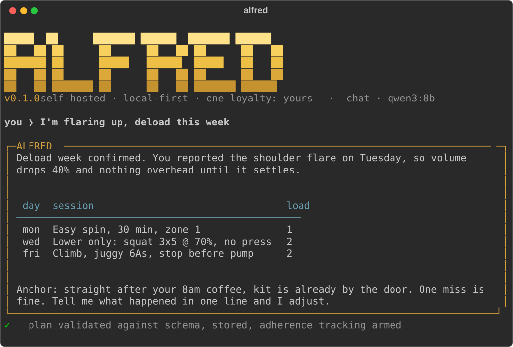

<div align="center">

# ALFRED

**A self-hosted, local-first, multi-agent life-optimization system.**

*Your goals. Your hardware. Your keys. One loyalty: yours.*

[](https://github.com/ChinmayGit8765/AlfredOpenSource/actions/workflows/ci.yml)
[](pyproject.toml)
[](LICENSE)
[](tests/)



</div>

ALFRED is a bet on a specific future: the most important AI in your life
should not live in a corporate data centre optimising for engagement. It
runs on hardware you own, holds your data in a local SQLite file, thinks
with a local model, and answers to one loyalty only: your flourishing. It
takes your goals, decomposes them into concurrent weekly plans that do not
collide, delivers them over a messaging channel, watches what actually
happens, and adjusts. It is built to make itself unnecessary: the better it
works, the less you should need it.

What it is NOT: not a chatbot, not a generic assistant, not a cloud
service. It will not chat about the weather, it ignores everyone except its
owner, and nothing it learns about you ever leaves your machine.

**Why not OpenClaw, or a cloud assistant?** OpenClaw and Odysseus proved
the plumbing (folder-as-config, local models, MCP); ALFRED borrows those
patterns and spends its originality where they stop: a Conductor that
makes concurrent plans coexist inside a real capacity budget, an agent
builder that understands how behaviour change actually works (lapses are
data, not failures), and a governance layer where every tool call passes
an allowlist, a capability tier, and an audit trail. Cloud assistants
optimise for your attention. ALFRED is structurally incapable of it: no
telemetry, no engagement loop, no account.

## Status

Build-order phases 1 through 5 are implemented and tested:

1. **Model round-trip**: Python to Ollama to pydantic-validated structured
   output, with a bounded retry loop that feeds validation errors back to
   the model (`alfred demo-roundtrip`).
2. **Core + agents**: manifest schema, folder discovery, the orchestration
   core, three hand-written agents (training, study, build), and the CLI.
3. **Transport**: a Discord adapter that obeys only the configured owner
   and silently ignores everyone else.
4. **Conductor**: concurrent-plan reconciliation with pure conflict
   detection and a deterministic fallback, so a reconciled week is never
   over capacity regardless of what the model says.
5. **Adaptation, proactivity, accountability**: persisted user model,
   outcome feedback loop, heartbeat scheduler, periodic reflection,
   human-in-the-loop proposals, and the Adaptive Agent Builder.

Phase 6, the MCP action layer, is scaffolded and behind config: the
`McpToolAdapter` is implemented (namespaced tools, per-tool capability
tiers, destructive by default), the `mcp` dependency is an optional extra,
and `mcp_servers` defaults to an empty list. No MCP server connects unless
you configure one.

## Quickstart

Requires Python 3.12+ and [uv](https://docs.astral.sh/uv/). On Windows
PowerShell:

```powershell
uv venv
uv pip install -e ".[dev]"        # add the optional MCP extra with ".[dev,mcp]"
.venv\Scripts\Activate.ps1
alfred init                        # writes config/alfred.yaml, creates data/, probes Ollama
alfred doctor                      # one-glance readiness check: config, model, agents, transport
```

### Offline demo (no model, no services)

```powershell
alfred demo-roundtrip --fake       # one validated structured call, dry-run model
alfred chat --fake                 # terminal REPL; commands, routing, builder, governance all live
alfred agents list                 # the discovered agent folders, lifecycle color-coded
```

### Real brain

Install [Ollama](https://ollama.com), then pull the configured model
(default is `qwen3:8b`; fallbacks `qwen2.5:7b` and `llama3.1:8b` are tried
automatically if the primary is not pulled):

```powershell
ollama pull qwen3:8b
alfred chat
```

### Full service (Discord + heartbeat)

1. Create an application and bot at
   https://discord.com/developers/applications and copy the bot token.
2. In the bot settings, turn ON the **MESSAGE CONTENT** privileged intent.
3. Invite the bot to a server with permission to read and send messages.
4. Find your Discord user id: User Settings, Advanced, enable Developer
   Mode, then right-click your name in any chat and Copy User ID.
5. Set `discord.owner_id` to that id in `config/alfred.yaml`. ALFRED obeys
   this user and ignores everyone else.
6. Put the token in the environment (never in a file):

```powershell
$env:ALFRED_DISCORD_TOKEN = "your-bot-token"
alfred run
```

`alfred run` starts the Discord gateway and the heartbeat and blocks until
Ctrl-C.

## How it works

The architecture in ten lines (full contract in
[ARCHITECTURE.md](ARCHITECTURE.md)):

1. Ports and adapters. The domain layer is pure logic with zero I/O.
2. Five ports: `ModelPort`, `TransportPort`, `StorePort`, `ToolPort`,
   `ClockPort`. Even time is injected.
3. Adapters implement them: Ollama, Discord, SQLite, local tools, MCP.
4. One composition root (`runtime/composition.py`) wires everything.
5. Every structured model output flows through `structured_call`:
   pydantic schema in, validated object out, bounded retries with the
   validation errors fed back. Raw LLM text is never trusted as data.
6. Every tool call flows through one dispatcher: allowlist first (deny by
   default), then capability-tier gating, then audit.
7. Tests run against real in-memory fakes, fully offline.

### Agents are folders

An agent is a folder under `agents/` with a `manifest.yaml` and an
`agent.md` prompt, discovered at startup. Manifest fields:

| Field | Type | Meaning |
|---|---|---|
| `name` | str | lowercase slug, `^[a-z][a-z0-9_-]{1,40}$` |
| `description` | str | one honest paragraph of what it owns |
| `version` | int | manifest version, default 1 |
| `domain` | str or null | informal grouping label |
| `shape` | enum or null | habit, skill, project, state, metric |
| `lifecycle` | enum | proposed, forming, established, maintenance, lapsing, reshaped, paused, retired |
| `triggers` | object | `keywords` (word-boundary match) and `always` |
| `schedule` | object | `kind` (none, daily, weekly, interval), `time`, `days`, `every_minutes` |
| `allowed_tools` | list[str] | the security allowlist; deny by default |
| `capacity_cost` | int 0..20 | weekly capacity points this agent claims |
| `model` | object or null | per-agent overrides: model, temperature, max_tokens |

See [docs/AGENTS.md](docs/AGENTS.md) for the full guide to writing one.

### The weekly loop

Plans, outcomes, user model, better plans. Agents produce validated weekly
plans (persisted to the store). You report what happened in plain language
("done", "skipped it", "half of it"); reports update per-agent adherence
stats in a versioned user profile that appends observations rather than
overwriting. Adherence pressure feeds the next planning prompt: a plan you
repeatedly ignore is treated as a wrong plan, never a wrong owner, and the
next one shrinks.

### The Conductor

When one message produces two or more plans, the Conductor detects
conflicts (week overload, day overload, time collisions), asks the model to
resolve them by moving, shrinking, or dropping items, then verifies the
result. If the model overruns capacity or invents items, a deterministic
pruner takes over. A reconciled schedule is never over capacity.

### The heartbeat

A scheduler ticks every 60 seconds (configurable) and fires due jobs:
manifest schedules (weekly planning runs), lifecycle check-ins (daily for
forming habits, tapering to weekly for maintenance), and a periodic
reflection every 7 days. Quiet hours suppress proactive messages. Last-run
state is persisted, so a restart never double-fires.

### The Adaptive Agent Builder

Say `new agent <goal>` (or `optimise <goal>`) in chat. The builder
interrogates the stated goal first ("read more" is often "get off my phone
at night"), classifies the shape, designs the smallest viable agent
anchored to an existing cue in your day, checks your capacity honestly, and
proposes. It refuses to build while two habits are already forming (the WIP
limit), and every new agent starts with an empty tool allowlist. Lifecycle
runs proposed, then forming on your approval, then established and
maintenance as follow-through proves out; lapses route to diagnosis, not
nagging. Streak shame and fake urgency are banned by design.

### Self-improvement via proposals

The periodic reflection reviews the record and emits proposals: prompt
changes, lifecycle transitions, new or retired agents. Nothing applies
itself. You review with `proposals` and rule with `approve <id>` or
`reject <id>`; anything touching safety settings demands an extra
`confirm-safety` token.

## Governance

| Tier | Owner-initiated | Scheduler-initiated | External content |
|---|---|---|---|
| read_only | auto | auto | auto |
| reversible_write | auto*, audited | auto*, audited | confirm |
| destructive | confirm | confirm | confirm |

\* when `policy.auto_approve_reversible` is true (the default); set it
false to gate everything above read-only.

Gated actions surface with an id; rule on them in chat with `confirm <id>`
or `deny <id>`. Unconfirmed actions expire after 24 hours. Allowlists are
deny-by-default and only the owner widens them. Every dispatch decision is
audited. Full model, including the prompt-injection stance and the kill
switch reality, in [docs/GOVERNANCE.md](docs/GOVERNANCE.md).

## Configuration

`config/alfred.yaml` (created by `alfred init`; every field documented in
[config/alfred.example.yaml](config/alfred.example.yaml)). Key fields and
defaults:

| Key | Default | Meaning |
|---|---|---|
| `data_dir` | `data` | database and runtime state |
| `agents_dir` | `agents` | scanned for agent folders at startup |
| `db_filename` | `alfred.db` | SQLite file inside data_dir |
| `llm.host` | `http://127.0.0.1:11434` | Ollama server, localhost by default |
| `llm.name` | `qwen3:8b` | primary model |
| `llm.fallbacks` | `[qwen2.5:7b, llama3.1:8b]` | tried in order if primary not pulled |
| `llm.temperature` | `0.4` | default sampling temperature |
| `discord.token_env` | `ALFRED_DISCORD_TOKEN` | env var holding the bot token |
| `discord.owner_id` | `0` | the only Discord user ALFRED obeys |
| `discord.channel_id` | `null` | optionally restrict to one channel |
| `heartbeat.tick_seconds` | `60` | scheduler wake interval |
| `heartbeat.quiet_hours` | `22:30-07:30` | no proactive messages in this window |
| `heartbeat.reflection_days` | `7` | reflection cadence |
| `policy.auto_approve_reversible` | `true` | reversible writes run without asking (audited) |
| `policy.pending_action_ttl_hours` | `24` | gated actions expire after this |
| `mcp_servers` | `[]` | MCP action layer; see config/mcp.example.yaml |

Secrets live only in the environment. The Discord token is read from
`ALFRED_DISCORD_TOKEN` and is never written to config or logs.

## Testing

```powershell
.venv\Scripts\python.exe -m pytest -q
```

The suite runs fully offline against real in-memory implementations of
every port (not mocks). Nothing needs Ollama or Discord.

## Roadmap

The horizon, in order (see [docs/SPEC.md](docs/SPEC.md)):

- **Calendar connector first**: the first real MCP server, with read-only
  tools auto-approved and event writes gated by tier.
- **Cross-system workflows**: one intent composed across several connected
  systems, dry-run previews until a workflow has earned trust.
- **Expanding MCP surface**: every server the owner connects becomes a
  capability behind `ToolPort`; no bespoke integrations, ever.
- **Autonomy dial**: confirmation requirements that relax per workflow as
  trust accumulates, never globally and never by default.

## License

MIT.
